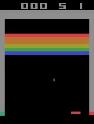
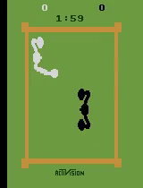

## Mastering Atari Games with Deep Reinforcement Learning

This was work was done as a part of the course project of **CS 419 - Introduction to Machine Learning**, under Prof. Abir De.  

The details about the project, previous work, our contributions, and our results can be found in the [report](./report.pdf) and the [presentation](https://docs.google.com/presentation/d/1TeRGIwsnyoDiWTUH6QR1lR4HPa8Y7-0knkpO6TBXlzk/edit?usp=sharing)

### Results

Pong            |  Breakout       |  Boxing
:-------------------------:|:------------------------:|:-------------------------:|
  |    |  

### Instructions to Run Code

```bash
conda create -n env # create new conda environment
conda activate env # activate the conda environment
pip install -r requirements.txt # install dependencies
jupyter notebook <path/to/notebook> # opens the required notebook in jupyter
# run all cells in the notebook
```

**Repository Structure:**

```bash
.
├── DQN
│   ├── DeepRL_boxing.ipynb
│   ├── DeepRL_breakout.ipynb
│   ├── DeepRL_pong.ipynb
│   ├── Param.py
│   ├── model.py
│   ├── models
│   │   ├── # saved model weights checkpoints for multiple games
│   ├── replay_memory.py
│   ├── utils.py
│   ├── videos
│   │   ├── # videos of agent playing multiple games
│   └── wrappers.py
├── Double-DQN
│   ├── DeepRL_boxing_modified.ipynb
│   ├── DeepRL_breakout_modified.ipynb
│   ├── DeepRL_pong_modified.ipynb
│   ├── Param_modif.py
│   ├── model.py
│   ├── models_modified
│   │   ├── # saved model weights checkpoints for multiple games
│   ├── replay_memory.py
│   ├── utils_modif.py
│   ├── videos_modified
│   │   ├── # videos of agent playing multiple games
│   └── wrappers.py
├── README.md
├── report.pdf
└── requirements.txt
```

**Note:** The two DQN and Double-DQN folders in the top directory are standalone folders containing the respective implementation. Also, each game has a separate IPython notebook as indicated in the tree above.